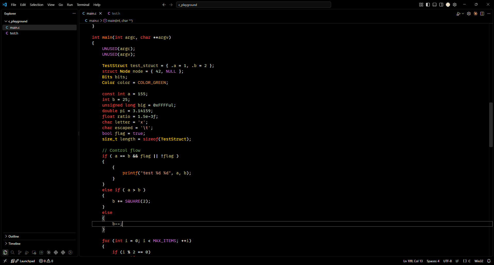
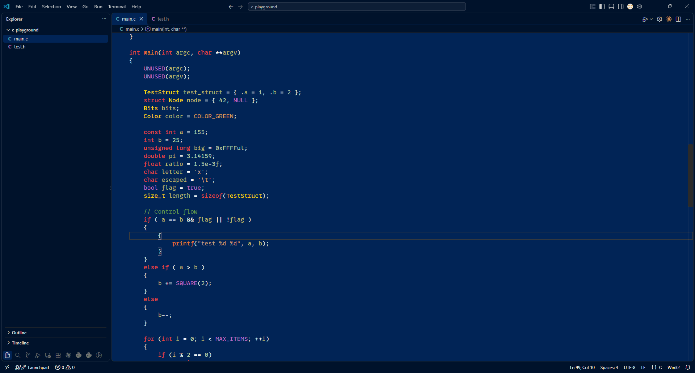
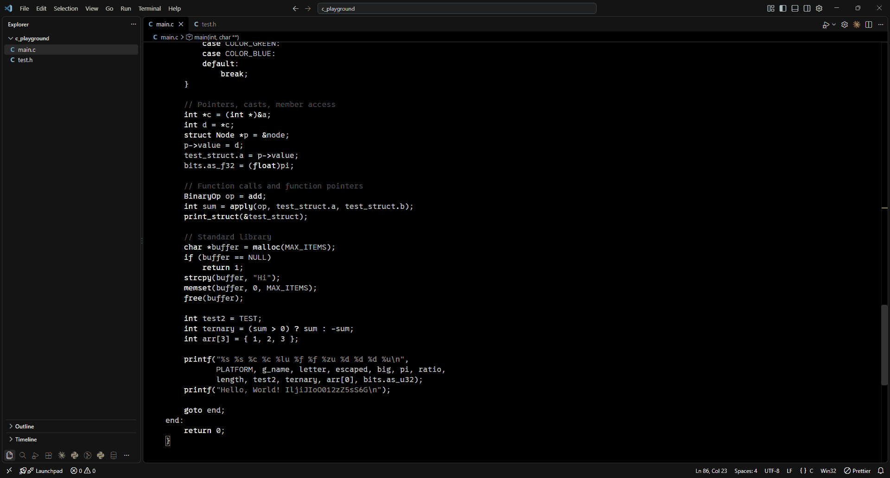
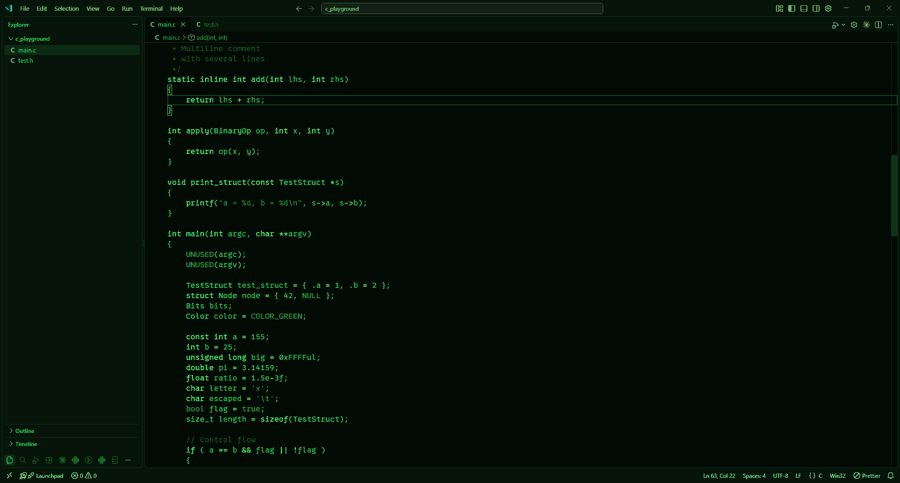
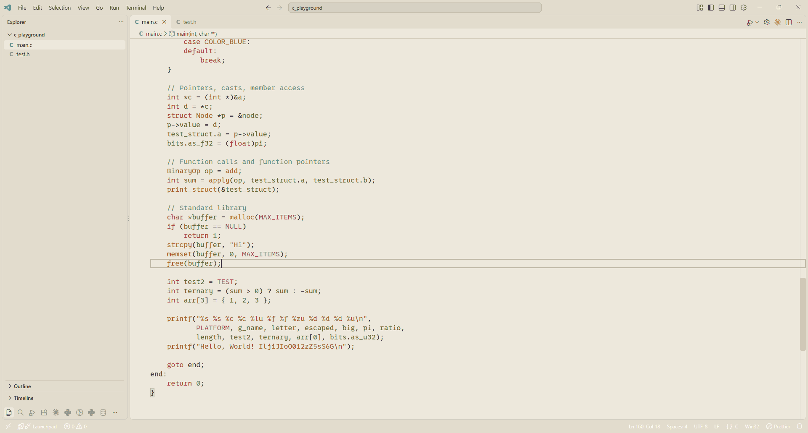
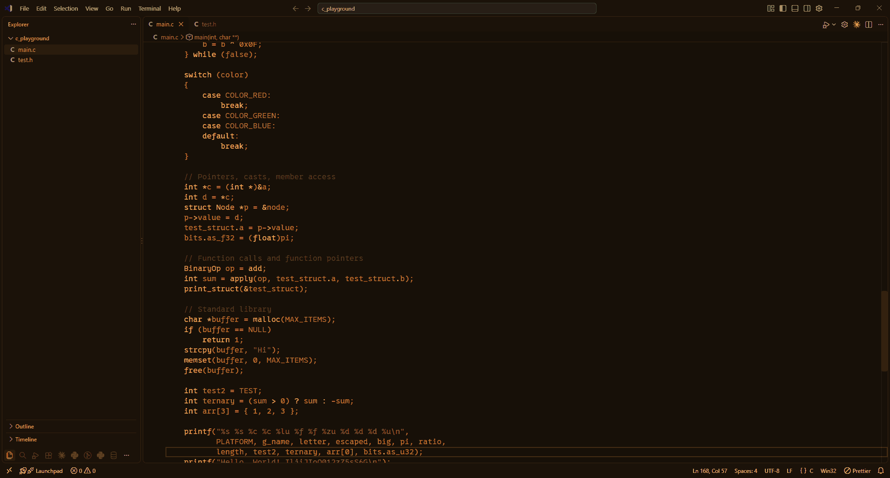
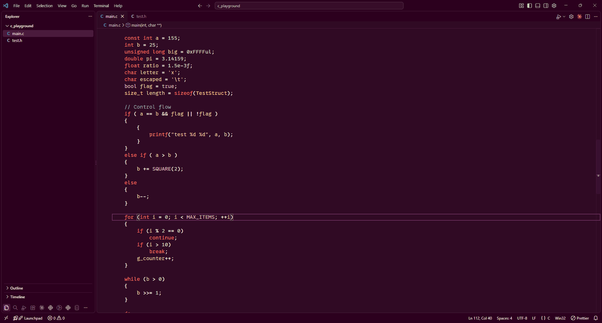

# sm_themes

## Install

Windows (PowerShell):

```powershell
irm https://raw.githubusercontent.com/milarditch/sm_themes/main/install.ps1 | iex
```

macOS or Linux:

```bash
curl -fsSL https://raw.githubusercontent.com/milarditch/sm_themes/main/install.sh | sh
```

Restart VS Code, press `Ctrl+K Ctrl+T` and select "sm_dark_full", "sm_powershell", "sm_dark_black_white", "sm_matrix", "sm_light", "sm_amber" or "sm_ubuntu".
To update, run the same command again.

## Showcase

The font in the screenshots is [0xProto Nerd Font Mono](https://www.nerdfonts.com/font-downloads) (the Nerd Font version of [0xProto](https://github.com/0xType/0xProto)), at size 16.

### sm_dark_full



### sm_powershell



### sm_dark_black_white



### sm_matrix



### sm_light



### sm_amber



### sm_ubuntu



## Recommended settings

```json
"editor.semanticHighlighting.enabled": true,
"C_Cpp.enhancedColorization": "enabled",
"editor.bracketPairColorization.enabled": false
```
